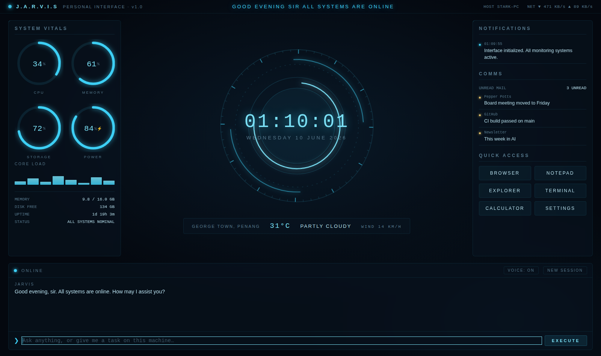

# JARVIS Dashboard

A personal, JARVIS-inspired desktop command center for Windows. Dark holographic interface, live system telemetry, an arc-reactor clock, weather, notifications, email, app shortcuts — and a console wired to your locally installed Claude Code, with spoken replies in a calm British voice.



---

## 1. Prerequisites

1. **Node.js 18+** — https://nodejs.org (LTS is fine). Verify with `node -v`.
2. **Claude Code** installed and signed in:
   ```
   npm install -g @anthropic-ai/claude-code
   claude
   ```
   Run `claude` once in a terminal and complete the login. The dashboard talks to this same CLI, so if `claude -p "hello"` works in your terminal, the dashboard will work too.
   Docs: https://docs.claude.com/en/docs/claude-code/overview
3. **The JARVIS voice** — by default the dashboard speaks through a bundled, offline **neural voice** (Piper, `en_GB-alan-medium` — a calm British male close to the films). Restore it after cloning with:
   ```
   npm run setup-voice
   ```
   This downloads the Piper engine + voice model (~85 MB, one time) into `vendor/piper`. No API key, no internet at runtime. If you skip it, JARVIS falls back to the system voice — for that, install a **English (United Kingdom)** voice via Windows Settings → Time & Language → Speech → Manage voices, and set `voice.engine` to `"system"` in `config.json`.

## 2. Install & run

```
cd jarvis-dashboard
npm install
npm run setup-voice
npm start
```

First launch downloads Electron (~100 MB, one time). On first run JARVIS creates your
personal `config.json` automatically from the template, then greets you out loud and goes live.

To build an installable .exe:

```
npm run dist
```

The installer lands in the `dist/` folder. It bundles the voice engine and the **clean
template** (never your personal `config.json`), so it ships no secrets — each user gets a
fresh config seeded on first launch.

## 3. Configure — in‑app Settings (no JSON required)

Click **⚙ SETTINGS** in the top bar to set everything from inside the app — assistant name,
voice, weather location, email (IMAP), Spotify (with a Connect button), Quick Access
shortcuts, the Claude console, and alert thresholds. Changes save instantly and most apply
live; a **Restart** button covers the rest. This is the intended path for end users.

Power users can still edit `config.json` directly (in dev it's the project file; in an
installed build it's under your user-data folder). Edit it, restart the app.

| Key | What it does |
|---|---|
| `assistantName`, `userTitle` | Branding and how it addresses you ("sir", "boss", your name…) |
| `voice.engine` | `"piper"` (bundled neural British voice, default) or `"system"` (browser/Windows TTS) |
| `voice.piper.model` | Voice model filename under `vendor/piper/models` — swap in any Piper voice |
| `voice.piper.lengthScale` | Pacing; >1 is slower/more measured (1.05 ≈ composed butler delivery) |
| `voice.piper.sentenceSilence` | Pause in seconds between sentences |
| `voice.preferredVoiceContains` | (system engine) Substring matched against installed voice names, e.g. `"United Kingdom"` |
| `voice.rate` / `voice.pitch` | (system engine) Speaking speed and depth (0.9 pitch ≈ composed and low) |
| `claude.workingDir` | The folder Claude Code operates in. Point it at a projects folder to scope its reach |
| `claude.allowedTools` | Tools Claude may use **without asking**. Default `Read,Glob,Grep` = it can look but not touch |
| `claude.personality` | The persona injected at the start of every session |
| `shortcuts` | Quick-access tiles. `target` can be an .exe name, full path, URL, or `ms-settings:` page |
| `email` | IMAP unread checker (see below) |
| `weather` | Open-Meteo coordinates — free, no API key |
| `alerts` | Thresholds for spoken CPU / memory / battery warnings |

### Letting JARVIS actually do things

By default Claude Code runs **read-only** from the dashboard — it can search and read files but not modify anything or run commands. To let it act, expand `claude.allowedTools`, for example:

```json
"allowedTools": "Read,Glob,Grep,Write,Edit,Bash(git *)"
```

Add capabilities deliberately and keep `workingDir` scoped to folders you're comfortable with — anything you allow here runs without a confirmation prompt. Permission syntax: https://docs.claude.com/en/docs/claude-code/overview

### Email (optional)

Set `email.enabled` to `true` and fill in IMAP details. For Gmail, create an **App Password** (Google Account → Security → 2-Step Verification → App passwords) — never your real password. The COMMS panel then shows unread count and the latest senders, and JARVIS announces new mail aloud.

> Note on notifications: Windows does not let apps read *other* apps' toast notifications, so the NOTIFICATIONS panel is the dashboard's own feed — system alerts (high CPU, low battery), new mail, launches, and anything JARVIS wants to tell you.

## 4. Using the console

- Type and hit **Enter** / **EXECUTE**. Replies stream into the log and are spoken aloud; the reactor core pulses while JARVIS speaks.
- The conversation has memory — follow-ups work ("now rename it", "what about the second one"). **NEW SESSION** starts fresh.
- **VOICE: ON/OFF** mutes speech without disabling it in config.
- Tasks run through Claude Code with your machine as context: "find the largest files in my Downloads folder", "summarize the README in my project", "draft a .gitignore for a Python project and save it" (requires Write permission).

## 5. Ideas to extend

- **Voice input**: add push-to-talk via a local speech-to-text like Vosk or whisper.cpp, feeding the transcript into the same console.
- **Always-on display**: uncomment `win.setFullScreen(true)` in `main.js` and run it on a spare monitor.
- **Auto-start**: drop a shortcut to `npm start` (or the built .exe) into `shell:startup`.

## A note on the theme

The interface is an original design *inspired by* the holographic style of cinematic AI assistants — it uses no studio assets, and the voice is a standard system/web TTS voice, not an imitation of any actor. It's built for personal use.
